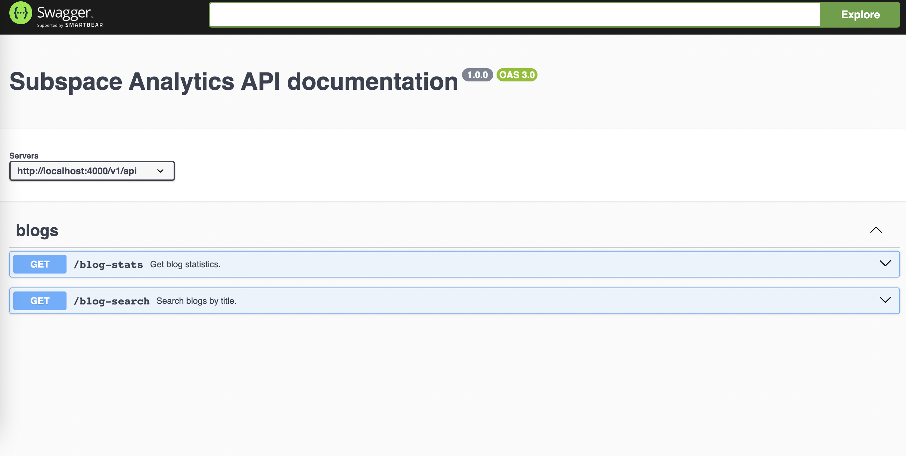

  <h5 align="center">Subspace Analytics : Blog Analytics with Express and Lodash</h5>

---

#### Documentation

- How to run the server?

  - Install all the dependencies: `npm install`
  - Create `.env` file & copy values from .env.sample, paste the `x-hasura-admin-secret` for key `BLOG_HASURA_KEY`
  - To run the server: `npm start`
  - Voila! Server will be running on localhost:4000

- How to access Swagger?

  - After installation and running the server, you can access swagger from [http://localhost:4000/docs](http://localhost:4000/docs)
  - 

- [Where can I find me cUrl requests?](./docs/cUrls/)
